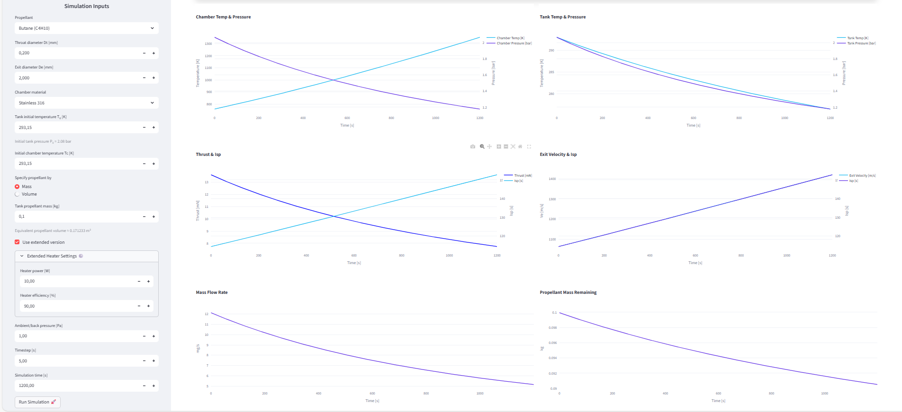

# Resistojet_App — Documentation


## Introduction
This app is a Python-based simulation tool designed for engineering analysis of resistojet propulsion systems. It allows users to simulate the thermodynamic behavior of the propellant in the tank and chamber, compute nozzle flow parameters, and evaluate resulting thrust and specific impulse. The program also provides time-dependent visualizations for temperature, pressure, mass flow, and performance metrics.


## Program architecture & module responsibilities

```
Resistojet_App/
├─ app.py             # Streamlit UI & simulation loop
├─ fluids.py          # FLUIDS data + initialization
├─ materials.py       # MATERIALS data + accessors
├─ thermo.py          # cp(T), gamma, Antoine, p(T)
├─ tank.py            # Tank class: T, p, heat, vaporization
├─ chamber.py         # Chamber: Tc calculation
├─ performance.py     # Resistojet: Tank + Chamber + Nozzle
├─ plots.py           # Visualization helpers
```

---

## Key classes, functions, and algorithms

### `Tank` class

* `step(Qdot, mass_current, mdot_vapor, dt)` → returns updated `T_tank` and `p_tank`.

### `Chamber` class

* `update_conditions(Pt, Tt, mdot_in, Qdot_heater, Tc_guess)` → iteratively solves `Tc`.

### `Resistojet` class

* `step(dt, Qdot_chamber, heater_on, Tc_guess)` → updates tank, chamber, nozzle, mass, thrust, Isp.

### `thermo.py`

* `compute_p0_from_T0(T0, fluid_name)` → returns vapor pressure.
* `gamma_from_cp(cp, M)` → ratio of specific heats.

---

## DATABASE

### `fluids.py` — Propellant database
The `FLUIDS` and `MATERIALS` databases store all thermophysical and structural properties needed for resistojet simulations. These centralized datasets allow easy access to fluid characteristics, material limits, and empirical coefficients used throughout the program.

`FLUIDS` contains the thermophysical properties and empirical coefficients for each propellant.
All quantities are expressed in **SI units** unless stated otherwise.

```python
FLUIDS = {
    "<Fluid name>": {
        "M_kg_per_mol": float,           # [kg/mol] 
        "gamma": float,                 
        "rho_liquid_kg_per_L": float,    # [kg/L] 
        "default_p0_Pa": float,          # [Pa] 
        "default_T0_K": float,           # [K] 

        "antoine": [                     
            {"Tmin": float, "Tmax": float, "A": float, "B": float, "C": float},
            ...
        ],

        "cp_poly": {"a": float, "b": float, "c": float, "d": float},  # cp(T) 

        "boiling_T_K": float,            
        "critical_T_K": float,           
        "critical_P_Pa": float,          

        "latent_heat_J_per_kg": float,   
        "cp_liquid_J_per_kgK": float,    
        "cp_gas_J_per_kgK": float,       
    },
    ...
}
```

### `materials.py` — Material database

`MATERIALS` serves as a centralized database of thermal and physical properties for structural materials used in the resistojet system.

```python
MATERIALS = {
    "<Material name>": {
        "cp": float,       # [J/kg·K] 
        "T_crit": float    # [K]
    },
    ...
}
```

---

## thermo.py

The `thermo.py` module provides thermodynamic property calculations essential for tank and chamber modeling. It includes specific heat functions, ratio of specific heats, and vapor pressure computations using the Antoine equation.

```python
def cp_poly_factory(fluid_name: str, T0: float) -> Callable[[float], float]:
    ...
```

* **Purpose:** Return a callable function for specific heat $c_p(T)$ as a polynomial of temperature.
* **Equation:** $c_p(T) = a + bT + cT^2 + dT^3$  &nbsp;&nbsp;&nbsp;&nbsp;&nbsp;&nbsp;&nbsp;&nbsp;&nbsp;&nbsp;&nbsp;&nbsp;&nbsp;&nbsp;&nbsp;&nbsp;&nbsp;[[3]](#ref3)

Where $(a, b, c, d)$ are fluid-specific coefficients from the `FLUIDS` database.
 

---

### 2. `gamma_from_cp(cp: float, molar_mass_kg_per_mol: float) -> float`

```python
def gamma_from_cp(cp: float, molar_mass_kg_per_mol: float) -> float:
    ...
```

* **Purpose:** Compute ratio of specific heats $(\gamma = c_p / c_v)$.
* **Equations:** $R_\text{specific} = \frac{R_\text{universal}}{M},\quad c_v = c_p - R_\text{specific},\quad \gamma = \frac{c_p}{c_v}$&nbsp;&nbsp;&nbsp;&nbsp;&nbsp;&nbsp;&nbsp;&nbsp;&nbsp;[[6]](#ref6)


---

### 3. `compute_p0_from_T0(T0: float, fluid_name: str) -> float`

```python
def compute_p0_from_T0(T0: float, fluid_name: str) -> float:
    ...
```

* **Purpose:** Compute tank vapor pressure from temperature using the Antoine equation.
* **Antoine equation (used in code):** $\log_{10}(P) = A - \frac{B}{T + C}$&nbsp;&nbsp;&nbsp;&nbsp;&nbsp;&nbsp;&nbsp;&nbsp;[[2]](#ref2)

Where $P$ is vapor pressure (Pa), $T$ is temperature (K) and $(A,B,C)$ are Antoine coefficients taken from the `FLUIDS` entry appropriate to the temperature range.
* **Notes:** Implement coefficient selection by matching `T0` to the `Tmin`/`Tmax` ranges in the `antoine` table. Convert log10 result to Pa (Antoine constants are commonly reported for pressure in bar, mmHg or kPa — normalize units when loading data).
* **In-text citation:** 

---

## tank.py

### `Tank.__init__(self, fluid_name: str, T0: float = None)`

* **Purpose:** Initialize tank with fluid properties and initial temperature.
* **State variables:**

  * `self.T` = temperature [K]
  * `self.p` = pressure [Pa]
  * `self.cp` = specific heat [J/kg/K]
  * `self.L_vap` = latent heat of vaporization [J/kg]

---

### `Tank.update_mass(mass_current: float, mdot: float, dt: float) -> float`

```python
def update_mass(mass_current, mdot, dt):
    return mass_current - mdot * dt
```

* **Purpose:** Compute remaining propellant mass after a timestep.

---

### `Tank.update_pressure(self)`

```python
def update_pressure(self):
    self.p = compute_p0_from_T0(self.T, self.fluid_name)
```

* **Purpose:** Compute tank pressure from current temperature using `compute_p0_from_T0`.
* **Notes:** Ensure unit consistency — `compute_p0_from_T0` must return Pa.

---

### `Tank.remove_vaporization_heat(self, mdot_vapor, mass_current, dt)`

```python
def remove_vaporization_heat(self, mdot_vapor, mass_current, dt):
    delta_T = - (mdot_vapor * self.L_vap * dt) / (mass_current * self.cp)
    self.T += delta_T
```

* **Purpose:** Reduce tank temperature due to vaporization.
* **Equation:** $ΔT = - \dfrac{\dot{m_\text{vap}} L_\text{vap} \ dt}{m_\text{current} \ c_p}$ &nbsp;&nbsp;&nbsp;&nbsp;&nbsp;&nbsp;&nbsp;[[4]](#ref4)
---

### `Tank.add_heat(self, Qdot, mass_current, dt)`

```python
def add_heat(self, Qdot, mass_current, dt):
    delta_T = (Qdot * dt) / (mass_current * self.cp)
    self.T += delta_T
```

* **Purpose:** Increase tank temperature due to heater or environmental heat.
* **Equation:**  $\Delta T = \dfrac{Q_\text{dot}  dt}{m_\text{current} c_p}$.

---

### `Tank.step(self, Qdot, mass_current, mdot_vapor, dt) -> dict`

```python
def step(self, Qdot, mass_current, mdot_vapor, dt) -> Dict[str, float]:
    self.remove_vaporization_heat(mdot_vapor, mass_current, dt)
    self.add_heat(Qdot, mass_current, dt)
    self.update_pressure()
    return {"T_tank": self.T, "P_tank": self.p}
```

* **Purpose:** Advance tank state one timestep. Updates temperature and pressure using heater input and vaporization.
* **Returns:** `{"T_tank": ..., "P_tank": ...}`

---

## chamber.py

### `Chamber.update_conditions(self, Pt, Tt, mdot_in=None, Qdot_heater=0.0, Tc_guess=None)`

```python
def update_conditions(self, Pt, Tt, mdot_in=None, Qdot_heater=0.0, Tc_guess=None):
    # iterative solve for Tc:
    # Tc_new = Tt + Qdot_heater / (mdot_eff * cp(Tc_new))
    ...
```

* **Purpose:** Compute chamber gas temperature $(T_c)$ and pressure $(P_c)$ using heater input.
* **Iterative energy balance (conceptual):** $T_c = T_t + \frac{Q_\text{heater}}{\dot{m}_\text{eff}, c_p(T_c)},\quad P_c \approx P_t$
* **Implementation notes:**

  * Use a small constant `mdot_eff` floor to avoid divide-by-zero when `mdot_in` is very small.
  * Solve with a simple fixed-point iteration or Newton method for robustness.

---

### `Chamber.summary(self) -> dict`

* **Purpose:** Returns material and fluid properties.
* **Output example:** `{"Material": ..., "Critical T [K]": ..., "Fluid": ...}`

---

## performance.py

### `Mach_from_area_ratio(Ae_At, gamma, supersonic=True) -> float`

```python
def Mach_from_area_ratio(Ae_At, gamma, supersonic=True):
    # solve A/A* = ... for M. Use initial guess M>1 for supersonic branch.
    ...
```

* **Purpose:** Solve for Mach number from nozzle area ratio.
* **Equation:** $\frac{A_e}{A^*} = \frac{1}{M}\left[\frac{2}{\gamma+1}\left(1 + \frac{\gamma-1}{2}M^2\right)\right]^{\frac{\gamma+1}{2(\gamma-1)}}$ &nbsp;&nbsp;&nbsp;&nbsp;&nbsp;&nbsp;&nbsp;&nbsp;&nbsp;[[5]](#ref5)

---

### `Resistojet.performance_no_heater(Tt, pt) -> dict`

* **Purpose:** Compute cold-gas resistojet performance using isentropic relations and choked-flow where appropriate.
* **Key relations used:** mass flow from choked/no-choked conditions, exit temperature from isentropic expansion, thrust including pressure thrust term.
* **Equations (conceptual):** $\dot{m} = \rho^* V^* A^*, \quad T_e = \frac{T_t}{1 + 0.5(\gamma-1)M_e^2}, \quad
  F= \dot{m} V_e + (p_e - p_\text{back}) A_e$&nbsp;&nbsp;&nbsp;&nbsp;&nbsp;&nbsp;&nbsp;&nbsp;&nbsp;[[5]](#ref5)

---

### `Resistojet.performance_with_heater(Tt, pt, Tc=None, Tc_guess=None) -> dict`

* **Purpose:** Compute hot-gas performance with heater input by substituting $T_c$ for $T_t$ in the performance relations.
* **Notes:** Account for temperature-dependent cp and gamma where possible.

---

### `Resistojet.step(dt, Qdot_chamber=0.0, heater_on=True, Tc_guess=None) -> dict`

* **Purpose:** Advance resistojet simulation one timestep.
* **Control flow (conceptual):**

  1. Compute tank `T_t`, `p_t` via `Tank.step(...)`.
  2. Use `Chamber.update_conditions(...)` to find `T_c` (if heater on).
  3. Compute mass flow and nozzle performance via `performance` functions.
  4. Update propellant mass: `m_new = m_old - mdot * dt`.
  5. Compute thrust, Isp, and telemetry for this step.
* **Equations used (summary):**
  $T_\text{tank,new} = T_\text{tank} - \frac{\dot{m} L_\text{vap}  dt}{m , c_p}, \quad
  P_\text{tank,new} = P_\text{sat}(T_\text{tank,new}),\quad
  \text{Isp} = \frac{F}{\dot{m} g_0}$

---

## App & Plots — Quick Reference

### `area_from_diameter_mm(D_mm: float) -> float`

Returns cross‑sectional area (m²) from a diameter in mm.

---

### `run_simulation(...)` *(conceptual wrapper used by `app.py` loop)*

Creates `Resistojet`, runs the time loop, returns a `pandas.DataFrame` with timestep results (temps, pressures, mdot, Ve, thrust, Isp, remaining mass).

---

### `Resistojet.step(dt, Qdot_chamber=0.0, heater_on=True, Tc_guess=None) -> dict`

Advance one physics timestep: compute chamber T, mass flow, nozzle performance, update tank and propellant mass; returns telemetry for that step $(\dot{m}, V_e, F, I_{sp}, T_c, T_t, p_t, ...)$.

---

### Plot helpers

* `plot_temp_pressure(sim_df)` — Plot chamber & tank temperature and pressures vs time (paired figures).
* `plot_thrust_Isp(sim_df)` — Plot thrust and Isp vs time (and exit velocity vs Isp).
* `plot_mdot_prop_mass(sim_df, m_tank, dt)` — Plot mass flow rate vs time and remaining propellant mass vs time.

---

## Example — how to use the app (concise)

**Inputs (example, from the UI left panel):**

- Propellant: Butane (C4H10)  
- Throat diameter Dt = 0.2 mm, Exit diameter De = 2.0 mm  
- Tank initial temperature T₀ = 293.15 K, Initial chamber T_c = 293.15 K  
- Tank propellant mass = 0.10 kg (specified by Mass)  
- Use extended heater: Yes — Heater power = 10 W, Heater efficiency = 90%  
- Ambient/back pressure = 1.0 Pa  
- Timestep = 5.0 s, Simulation time = 1200 s

**What happens when you Run:**  
Open the Streamlit link, set the inputs in the left panel, then click **Run Simulation 🚀**. The app initializes the `Resistojet` (Tank + Chamber + performance), runs the time loop, and displays interactive plots and telemetry on the right. After the run the UI also shows summary metrics:

```
Total impulse - 12157.471 mN·s
Avg Thrust - 10.089 mN
Avg Isp - 133.44 s
Max Exit Velocity - 1419.49 m/s
```




You can export the full `sim_df` (CSV) containing every timestep's `T_tank`, `P_tank`, `T_chamber`, `mdot`, `Ve`, `thrust`, `Isp`, and `mass_remaining`.

---

## Assumptions

* Flow in the nozzle and chamber is isentropic (adiabatic and reversible).

* Choked flow is assumed when the throat reaches Mach 1.

* The propellant is treated as a perfect gas above its boiling point; specific heats are temperature‑dependent.

* Heat addition in the chamber and tank follows a lumped‑capacity approximation (uniformly distributed within each control volume).


---

## References


<a name="ref1"></a>**[1]** [NIST Chemistry WebBook — Thermophysical properties of fluids (densities, heat capacities, vaporization enthalpies, Antoine coefficients)](https://webbook.nist.gov/cgi/cbook.cgi?ID=C106978&Mask=1).  

<a name="ref2"></a>**[2]** [Antoine equation — Coefficients for vapor pressure calculation.](https://webbook.nist.gov/cgi/cbook.cgi?ID=C106978&Mask=4&Type=ANTOINE&Plot=on) 

<a name="ref3"></a>**[3]** [NASA Glenn Research Center, *Coefficients for Calculating Thermodynamic Properties of Individual Species*, 2002 — cp(T) polynomial coefficients.](https://ntrs.nasa.gov/api/citations/20020085330/downloads/20020085330.pdf)  

<a name="ref4"></a>**[4]** [NIST Chemistry WebBook — Latent heat / enthalpy of vaporization](https://webbook.nist.gov/cgi/cbook.cgi?ID=C106978&Mask=4) 

<a name="ref5"></a>**[5]** Sutton, G. P., & Biblarz, O., *Rocket Propulsion Elements*, 9th Edition — Nozzle performance, choked flow, thrust, exit velocity  
- Ch. 5 — Nozzle area–Mach relations and propulsion fundamentals

- Provides recommended L_vap values for various fluids  
<a name="ref6"></a>**[6]** Hill, P. G., & Peterson, C. R., *Mechanics and Thermodynamics of Propulsion*, 2nd Edition  
- Ch. 2, Sec. 2.2–2.3 — Perfect gas, cp, cv, γ, energy balances  
- Ch. 3, Sec. 3.3–3.4 — One-dimensional isentropic area–Mach relations
